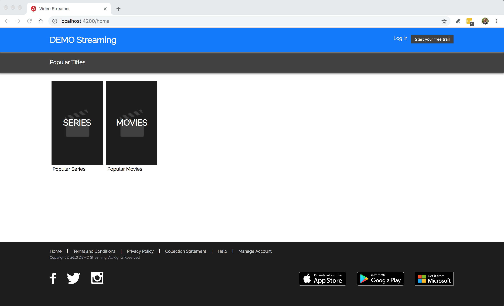

<h1 align="center">Angular | Video Streamer</h1>

  

# Overview

An AngularJS video streamer application using version 7.3.9.

## Development server

Run `npm start` for a dev server. Navigate to `http://localhost:4200/`. The app will automatically reload if you change any of the source files.

## Build

Run `npm build` to build the project. The build artifacts will be stored in the `dist/` directory. Use the `--prod` flag for a production build.

## Running unit tests

Run `npm test` to execute the unit tests via [Karma](https://karma-runner.github.io).

# Design and Implementation

## Technical and architectural choices used 

I decided the structure the project in a way that made sense to me, breaking it down by page (or route), components on the pages as well as shared components such as the header and footer. And then I added services and models used within the application. See below

- Components created:
   - Header
   - Footer
   - Video
   - Loader
   - Error
- Routes
   - Content (Home)
   - Movies
   - Series
- Models
   - Video
   - Search related
- Services
   - Video
   - Loader

## Improvements I could have made

- I could have implemented better unit as well as e2e testing
- Better responsive styling for mobile and tablet devices
- I could have implemented better error handling, i.e. use an inteceptor, similarly to how the loader works

## Things I would have approached differently had I had more time

- Implement a better API layer
- Paging, sorting and searching via the user interface
- Improved the build process and deployment pipeline 
- Added a basic express server to render the dist files